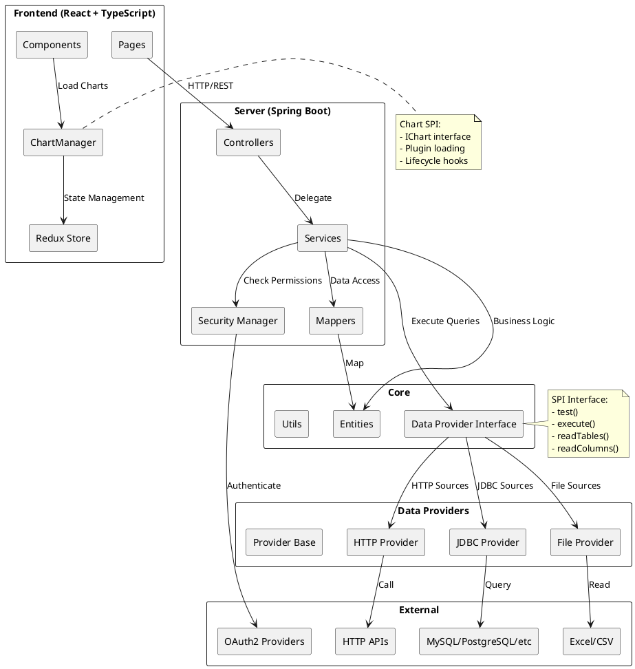
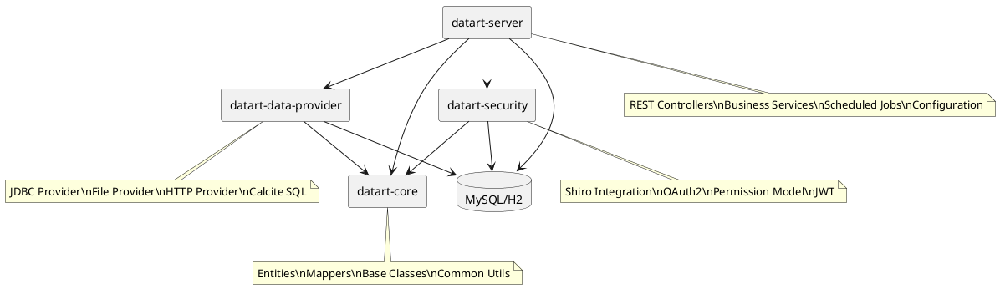
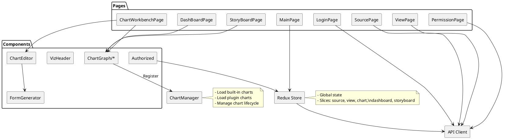
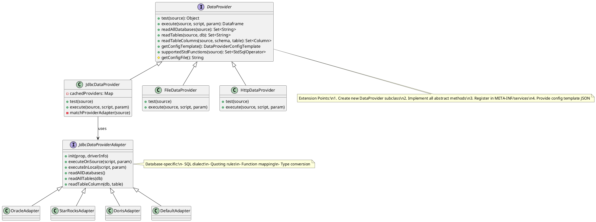
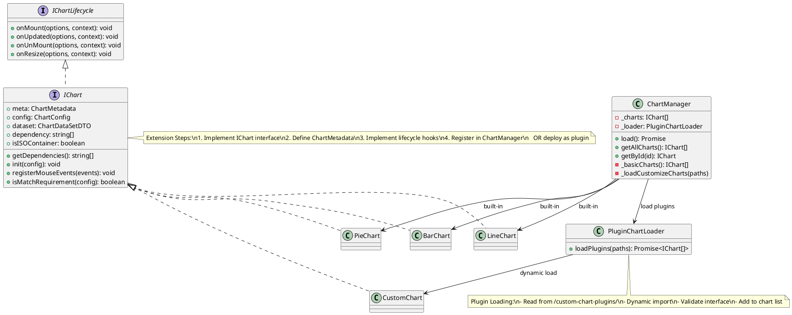

# Datart 架构分析报告

## 1. 项目概述

Datart 是一个开源的数据可视化平台，支持多数据源接入、图表制作、仪表板和故事板创作等功能。

**版本**: 1.0.0-rc.3  
**技术栈**: 
- 后端：Java 8 + Spring Boot 2.4.3 + MyBatis
- 前端：React + TypeScript + Redux
- 数据库：MySQL/H2
- 安全框架：Apache Shiro + Spring Security OAuth2

---

## 2. 后端模块结构

### 2.1 模块依赖关系

```
datart-parent (pom)
├── datart-core (jar)           # 核心模块 - 基础依赖
├── datart-security (jar)       # 安全模块 - 依赖 core
├── datart-data-provider (pom)  # 数据源模块 - 依赖 core
│   ├── data-provider-base
│   ├── jdbc-data-provider
│   ├── file-data-provider
│   └── http-data-provider
└── datart-server (jar)         # Web 服务层 - 依赖 core, security, data-providers
```

### 2.2 core/ 核心模块

**路径**: `core/src/main/java/datart/core/`

#### 主要包结构：

| 包名 | 职责 |
|------|------|
| `entity` | 实体类定义（User, Source, Dashboard, Datachart, View 等） |
| `entity/ext` | 扩展实体类（ViewBaseInfo, VizBaseInfo 等） |
| `entity/poi` | POI 导出相关实体 |
| `mappers` | MyBatis Mapper 接口 |
| `mappers/ext` | 扩展 Mapper 接口 |
| `data/provider` | 数据提供者核心接口和类 |
| `data/provider/sql` | SQL 解析和处理 |
| `data/provider/processor` | 数据提供者处理器（前置/后置） |
| `base` | 基础类、常量、异常、注解 |
| `common` | 通用工具类 |
| `cluster/gossip` | 集群 Gossip 协议实现 |
| `migration` | 数据库迁移 |
| `log` | 日志处理 |

#### 关键实体类：

- `User` - 用户
- `Organization` - 组织
- `Role` - 角色
- `Source` - 数据源
- `View` - 数据视图
- `Datachart` - 图表
- `Dashboard` - 仪表板
- `Widget` - 组件
- `Schedule` - 调度任务
- `Share` - 分享
- `Variable` - 变量

### 2.3 data-providers/ 数据源模块

**路径**: `data-providers/`

#### 模块结构：

```
data-providers/
├── data-provider-base/          # 数据源基础实现
│   └── datart/data/provider/
│       ├── base/                # 基础类和 DTO
│       ├── calcite/             # Calcite SQL 解析
│       ├── jdbc/                # JDBC 相关
│       ├── optimize/            # 查询优化
│       └── script/              # 脚本处理
├── jdbc-data-provider/          # JDBC 数据源实现
│   └── datart/data/provider/
│       ├── jdbc/adapters/       # 数据库适配器（Oracle, MySQL, StarRocks 等）
│       └── function/            # 自定义函数
├── file-data-provider/          # 文件数据源（Excel, CSV）
└── http-data-provider/          # HTTP API 数据源
```

#### 支持的数据库类型（通过 jdbc-driver.yml 配置）：

- MySQL
- Oracle
- PostgreSQL
- SQL Server
- H2
- StarRocks
- Doris
- Impala
- 等（支持扩展）

### 2.4 security/ 安全模块

**路径**: `security/src/main/java/datart/security/`

#### 包结构：

| 包名 | 职责 |
|------|------|
| `manager` | 安全管理器接口和实现 |
| `manager/shiro` | Shiro 安全实现（Realm, 密码匹配器） |
| `oauth2` | OAuth2 认证（钉钉、企业微信、自定义） |
| `base` | 安全基础类（Permission, PasswordToken） |
| `exception` | 安全异常（AuthException, PermissionDeniedException） |
| `util` | 安全工具类（JWT, AES, 权限帮助类） |

#### 核心接口：

- `DatartSecurityManager` - 安全管理器接口
- `PermissionDataCache` - 权限数据缓存

### 2.5 server/ Web 服务层

**路径**: `server/src/main/java/datart/server/`

#### 包结构：

| 包名 | 职责 |
|------|------|
| `controller` | REST API 控制器 |
| `service` | 业务逻辑接口 |
| `service/impl` | 业务逻辑实现 |
| `base/dto` | 数据传输对象 |
| `base/params` | 请求参数 |
| `base/transfer` | 数据转移 |
| `config` | 配置类（Security, CORS, Web） |
| `config/interceptor` | 拦截器 |
| `job` | 定时任务（Quartz） |
| `common` | 通用工具 |

#### 主要控制器：

| 控制器 | 路径前缀 | 功能 |
|--------|----------|------|
| `UserController` | `/api/users` | 用户管理 |
| `OrgController` | `/api/orgs` | 组织管理 |
| `RoleController` | `/api/roles` | 角色权限 |
| `SourceController` | `/api/sources` | 数据源管理 |
| `ViewController` | `/api/views` | 视图管理 |
| `DatachartController` | `/api/datacharts` | 图表管理 |
| `VizController` | `/api/viz` | 可视化（仪表板/故事板） |
| `ShareController` | `/api/shares` | 分享管理 |
| `ScheduleController` | `/api/schedules` | 调度任务 |
| `DataProviderController` | `/api/data-providers` | 数据提供者 |

---

## 3. 前端模块结构

### 3.1 整体结构

**路径**: `frontend/src/`

```
frontend/src/
├── app/                       # 应用主目录
│   ├── assets/                # 静态资源
│   ├── components/            # 组件库
│   ├── contexts/              # React Context
│   ├── hooks/                 # 自定义 Hooks
│   ├── migration/             # 数据迁移逻辑
│   ├── models/                # 模型类（ChartManager 等）
│   ├── pages/                 # 页面
│   ├── slice/                 # Redux Slice
│   ├── types/                 # TypeScript 类型定义
│   └── utils/                 # 工具函数
├── locales/                   # 国际化（en, zh）
├── redux/                     # Redux 配置
├── styles/                    # 样式
└── utils/                     # 通用工具
```

### 3.2 src/app/ 应用层

#### 核心模型：

| 模型 | 职责 |
|------|------|
| `ChartManager` | 图表管理器，加载和管理所有图表 |
| `PluginChartLoader` | 插件图表加载器 |
| `VizManager` | 可视化管理器 |

#### Redux Slice：

- `sourceSlice` - 数据源状态
- `viewSlice` - 视图状态
- `chartSlice` - 图表状态
- `dashboardSlice` - 仪表板状态
- `storyboardSlice` - 故事板状态

### 3.3 src/components/ 组件库

#### 主要组件：

| 组件目录 | 职责 |
|----------|------|
| `ChartGraph/*` | 各类图表实现（25+ 种基础图表） |
| `ChartEditor` | 图表编辑器 |
| `ChartDrill` | 图表下钻 |
| `FormGenerator` | 表单生成器 |
| `VizHeader` | 可视化头部 |
| `VizOperationMenu` | 可视化操作菜单 |
| `Authorized` | 权限控制组件 |

#### 图表组件结构：

```
ChartGraph/
├── AreaChart/
├── BasicAreaChart/
├── BasicBarChart/
├── BasicDoubleYChart/
├── BasicFunnelChart/
├── BasicGaugeChart/
├── BasicLineChart/
├── BasicOutlineMapChart/
├── BasicPieChart/
├── BasicRadarChart/
├── BasicRichText/
├── BasicScatterChart/
├── BasicTableChart/
├── ClusterBarChart/
├── ClusterColumnChart/
├── DoughnutChart/
├── LineChart/
├── MingXiTableChart/
├── NormalOutlineMapChart/
├── PercentageStackBarChart/
├── PercentageStackColumnChart/
├── PieChart/
├── PivotSheetChart/
├── ReactVizXYPlotChart/
├── RoseChart/
├── ScatterOutlineMapChart/
├── Scorecard/
├── StackAreaChart/
├── StackBarChart/
├── StackColumnChart/
├── WaterfallChart/
└── WordCloudChart/
```

### 3.4 src/pages/ 页面

#### 主要页面：

| 页面 | 路径 | 功能 |
|------|------|------|
| `LoginPage` | `/login` | 登录 |
| `RegisterPage` | `/register` | 注册 |
| `SetupPage` | `/setup` | 初始化设置 |
| `MainPage` | `/` | 主页面（组织内资源） |
| `ChartWorkbenchPage` | `/charts` | 图表工作台 |
| `DashBoardPage` | `/dashboards` | 仪表板页面 |
| `StoryBoardPage` | `/stories` | 故事板页面 |
| `SourcePage` | `/sources` | 数据源管理 |
| `ViewPage` | `/views` | 视图管理 |
| `VizPage` | `/viz` | 可视化管理 |
| `PermissionPage` | `/permissions` | 权限管理 |
| `MemberPage` | `/members` | 成员管理 |
| `SchedulePage` | `/schedules` | 调度管理 |
| `VariablePage` | `/variables` | 变量管理 |
| `OrgSettingPage` | `/org-settings` | 组织设置 |
| `SharePage` | `/share` | 分享页面（公开访问） |

---

## 4. 扩展点（SPI 接口）识别

### 4.1 数据源扩展接口

#### 核心接口：`DataProvider` (抽象类)

**位置**: `core/src/main/java/datart/core/data/provider/DataProvider.java`

```java
public abstract class DataProvider extends AutoCloseBean {
    // 核心方法
    public abstract Object test(DataProviderSource source) throws Exception;
    public abstract Set<String> readAllDatabases(DataProviderSource source) throws SQLException;
    public abstract Set<String> readTables(DataProviderSource source, String database) throws SQLException;
    public abstract Set<Column> readTableColumns(DataProviderSource source, String schema, String table) throws SQLException;
    public abstract Dataframe execute(DataProviderSource config, QueryScript script, ExecuteParam executeParam) throws Exception;
    public abstract String getConfigFile();
    public abstract boolean validateFunction(DataProviderSource source, String snippet);
    public abstract String getQueryKey(DataProviderSource config, QueryScript script, ExecuteParam executeParam) throws Exception;
    
    // 可选扩展方法
    public Set<StdSqlOperator> supportedStdFunctions(DataProviderSource source) { ... }
    public void resetSource(DataProviderSource source) { ... }
}
```

#### 扩展方式：

1. **继承 `DataProvider` 抽象类**
2. **实现所有抽象方法**
3. **在 `resources/META-INF/services/datart.core.data.provider.DataProvider` 中注册**

#### 示例：`JdbcDataProvider`

```java
public class JdbcDataProvider extends DataProvider {
    @Override
    public Object test(DataProviderSource source) { ... }
    
    @Override
    public Dataframe execute(DataProviderSource source, QueryScript script, ExecuteParam executeParam) { ... }
    
    // ... 其他实现
}
```

#### 数据库适配器扩展：

**位置**: `data-providers/jdbc-data-provider/src/main/java/datart/data/provider/jdbc/adapters/`

- `JdbcDataProviderAdapter` - 基础适配器
- `OracleDataProviderAdapter` - Oracle 适配
- `StarRocksDataProviderAdapter` - StarRocks 适配
- `DorisDataProviderAdapter` - Doris 适配
- 等...

**扩展方式**: 继承 `JdbcDataProviderAdapter` 并重写数据库特定方法

### 4.2 图表扩展接口

#### 核心接口：`IChart`

**位置**: `frontend/src/app/types/Chart.ts`

```typescript
export interface IChart extends IChartLifecycle {
  meta: ChartMetadata;
  config?: ChartConfig;
  dataset?: ChartDataSetDTO;
  dependency: string[];
  isISOContainer: boolean | string;
  useIFrame?: boolean;

  set state(state: ChartStatus);
  get state();

  getDependencies(): string[];
  init(config: any);
  registerMouseEvents(events: Array<ChartMouseEvent>);
  isMatchRequirement(targetConfig?: ChartConfig): boolean;
}

export interface IChartLifecycle {
  onMount(options: BrokerOption, context: BrokerContext): void;
  onUpdated(options: BrokerOption, context: BrokerContext): void;
  onUnMount(options: BrokerOption, context: BrokerContext): void;
  onResize(options: BrokerOption, context: BrokerContext): void;
}
```

#### 图表元数据：`ChartMetadata`

```typescript
interface ChartMetadata {
  id: string;           // 图表唯一标识
  name: string;         // 图表名称
  icon: string;         // 图标
  requirements: any;    // 数据要求
}
```

#### 扩展方式：

1. **创建图表组件目录** (如 `frontend/src/app/components/ChartGraph/MyCustomChart/`)
2. **实现 `IChart` 接口**
3. **在 `ChartManager.ts` 中注册** 或通过插件机制动态加载
4. **插件图表**: 将编译后的图表放到 `public/custom-chart-plugins/` 目录

#### 图表管理器：

**位置**: `frontend/src/app/models/ChartManager.ts`

```typescript
class ChartManager {
  private _charts: IChart[] = this._basicCharts();
  
  public async load() {
    const pluginsPaths = await getChartPluginPaths();
    await this._loadCustomizeCharts(pluginsPaths);
  }
  
  public getAllCharts(): IChart[] {
    return this._charts || [];
  }
}
```

### 4.3 权限扩展接口

#### 核心接口：`DatartSecurityManager`

**位置**: `security/src/main/java/datart/security/manager/DatartSecurityManager.java`

```java
public interface DatartSecurityManager {
    void login(PasswordToken token) throws AuthException;
    boolean validateUser(String username, String password) throws AuthException;
    String login(String jwtToken) throws AuthException;
    void logoutCurrent();
    boolean isAuthenticated();
    void requireAllPermissions(Permission... permission) throws PermissionDeniedException;
    void requireAnyPermission(Permission... permissions) throws PermissionDeniedException;
    void requireOrgOwner(String orgId) throws PermissionDeniedException;
    boolean isOrgOwner(String orgId);
    boolean hasPermission(Permission... permission);
    User getCurrentUser();
    void runAs(String userNameOrEmail);
    void releaseRunAs();
}
```

#### 权限模型：`Permission`

**位置**: `security/src/main/java/datart/security/base/Permission.java`

```java
public class Permission {
    private String orgId;      // 组织 ID
    private String roleId;     // 角色 ID
    private String resourceId; // 资源 ID
    private int permission;    // 权限值 (0:无，1:读，2:写，3:管理)
}
```

#### 扩展方式：

1. **实现 `DatartSecurityManager` 接口**
2. **自定义 `Permission` 计算逻辑**
3. **扩展 OAuth2 客户端** (`CustomOauth2Client`)

#### 权限拦截：

**位置**: `server/src/main/java/datart/server/config/interceptor/`

- `WebConfig` - Web 配置和拦截器注册
- 通过 AOP 和注解进行权限控制

### 4.4 其他扩展点

#### 数据提供者处理器：

- `DataProviderPreProcessor` - 数据查询前置处理器
- `DataProviderPostProcessor` - 数据查询后置处理器

#### 调度任务扩展：

- 通过 `Schedule` 实体和 Quartz 集成
- 可扩展自定义任务类型

#### 第三方认证扩展：

- `DingTalkOauth2Client` - 钉钉 OAuth2
- `WeChartOauth2Client` - 企业微信 OAuth2
- `CustomOauth2Client` - 自定义 OAuth2

---

## 5. 架构图

### 5.1 整体架构图



### 5.2 后端模块依赖图



### 5.3 前端组件架构图



### 5.4 数据源 SPI 扩展图



### 5.5 图表 SPI 扩展图



---

## 6. 关键类/接口清单

### 6.1 后端核心类

| 类/接口 | 位置 | 职责 |
|---------|------|------|
| `DataProvider` | `core/.../provider/DataProvider.java` | 数据源 SPI 基类 |
| `DataProviderManager` | `core/.../provider/DataProviderManager.java` | 数据源管理器接口 |
| `JdbcDataProvider` | `data-providers/.../JdbcDataProvider.java` | JDBC 数据源实现 |
| `JdbcDataProviderAdapter` | `data-providers/.../adapters/JdbcDataProviderAdapter.java` | JDBC 适配器基类 |
| `DatartSecurityManager` | `security/.../manager/DatartSecurityManager.java` | 安全管理器接口 |
| `ShiroSecurityManager` | `security/.../shiro/ShiroSecurityManager.java` | Shiro 实现 |
| `Permission` | `security/.../base/Permission.java` | 权限模型 |
| `BaseCRUDService` | `server/.../service/BaseCRUDService.java` | CRUD 服务基类 |
| `BaseController` | `server/.../controller/BaseController.java` | 控制器基类 |

### 6.2 实体类（Entity）

| 实体 | 表名 | 职责 |
|------|------|------|
| `User` | `users` | 用户 |
| `Organization` | `organizations` | 组织 |
| `Role` | `roles` | 角色 |
| `RelRoleUser` | `rel_role_user` | 角色 - 用户关联 |
| `RelRoleResource` | `rel_role_resource` | 角色 - 资源权限 |
| `Source` | `sources` | 数据源 |
| `View` | `views` | 数据视图 |
| `Datachart` | `datacharts` | 图表配置 |
| `Dashboard` | `dashboards` | 仪表板 |
| `DashboardWidget` | `dashboard_widgets` | 仪表板组件 |
| `Storyboard` | `storyboards` | 故事板 |
| `Storypage` | `storypages` | 故事页 |
| `Schedule` | `schedules` | 调度任务 |
| `Share` | `shares` | 分享 |
| `Variable` | `variables` | 变量 |

### 6.3 前端核心类

| 类/接口 | 位置 | 职责 |
|---------|------|------|
| `IChart` | `frontend/src/app/types/Chart.ts` | 图表接口 |
| `IChartLifecycle` | `frontend/src/app/types/Chart.ts` | 图表生命周期 |
| `ChartManager` | `frontend/src/app/models/ChartManager.ts` | 图表管理器 |
| `PluginChartLoader` | `frontend/src/app/models/PluginChartLoader.ts` | 插件加载器 |
| `ChartMetadata` | `frontend/src/app/types/ChartMetadata.ts` | 图表元数据 |

---

## 7. 改造影响范围评估

### 7.1 数据源扩展改造

**影响模块**: 
- `data-providers/data-provider-base` (核心逻辑)
- `data-providers/jdbc-data-provider` (JDBC 实现)
- `server` (数据源服务)

**改造点**:
1. 新增数据源类型：继承 `DataProvider`，实现接口方法
2. 新增数据库适配：继承 `JdbcDataProviderAdapter`
3. 扩展 SQL 解析：修改 Calcite 配置
4. 添加驱动配置：更新 `jdbc-driver.yml`

**风险评估**: ⚠️ **中等**
- 需要理解 Calcite SQL 解析
- 需要测试各种数据库兼容性
- 性能影响需验证

### 7.2 图表扩展改造

**影响模块**:
- `frontend/src/app/components/ChartGraph` (图表组件)
- `frontend/src/app/models/ChartManager` (图表管理)
- `frontend/src/app/types/Chart` (类型定义)

**改造点**:
1. 新增内置图表：创建组件目录，实现 `IChart`
2. 开发插件图表：独立编译，部署到插件目录
3. 扩展图表配置：修改 `ChartConfig` 类型
4. 添加交互事件：扩展 `ChartMouseEvent`

**风险评估**: ✅ **低**
- 前端模块化良好
- 插件机制成熟
- 不影响现有功能

### 7.3 权限模型改造

**影响模块**:
- `security` (安全模块)
- `server/service` (业务服务)
- `server/controller` (API 接口)

**改造点**:
1. 扩展权限类型：修改 `Permission` 类
2. 自定义认证：实现 `DatartSecurityManager`
3. 添加 OAuth2 提供商：扩展 `CustomOauth2Client`
4. 细粒度权限：修改权限检查逻辑

**风险评估**: ⚠️ **高**
- 安全相关，需严格测试
- 影响所有 API 访问
- 需考虑向后兼容

### 7.4 服务层改造

**影响模块**:
- `server/service` (业务逻辑)
- `server/controller` (API)
- `core/mappers` (数据访问)

**改造点**:
1. 新增业务功能：扩展 Service 接口和实现
2. 新增 API：添加 Controller 和方法
3. 数据模型变更：修改 Entity 和 Mapper
4. 数据库迁移：添加迁移脚本

**风险评估**: ⚠️ **中等**
- 需保持 API 兼容
- 数据库变更需谨慎
- 需考虑数据迁移

---

## 8. 风险点识别

### 8.1 技术风险

| 风险点 | 描述 | 影响 | 缓解措施 |
|--------|------|------|----------|
| **Calcite SQL 解析复杂性** | Calcite 学习曲线陡峭，SQL 解析规则复杂 | 高 | 充分测试，参考现有实现 |
| **数据库兼容性** | 不同数据库 SQL 方言差异大 | 中 | 为每种数据库编写适配器，充分测试 |
| **前端图表性能** | 大数据量渲染性能问题 | 中 | 实现数据采样，虚拟滚动 |
| **安全漏洞** | 权限绕过、SQL 注入等 | 高 | 代码审查，安全测试，使用参数化查询 |
| **版本升级** | Spring Boot 2.4.3 较老 | 中 | 评估升级可行性，注意 breaking changes |

### 8.2 架构风险

| 风险点 | 描述 | 影响 | 缓解措施 |
|--------|------|------|----------|
| **模块耦合** | server 模块依赖较多 | 中 | 保持接口抽象，依赖注入 |
| **单点故障** | 无集群部署支持（基础版） | 中 | 企业版已支持集群 |
| **缓存一致性** | 权限缓存可能过期 | 低 | 实现缓存失效机制 |
| **扩展点文档不足** | SPI 接口文档不完善 | 中 | 补充文档和示例 |

### 8.3 开发风险

| 风险点 | 描述 | 影响 | 缓解措施 |
|--------|------|------|----------|
| **前端 TypeScript 类型复杂** | 图表类型定义复杂 | 低 | 逐步理解，参考现有实现 |
| **后端 MyBatis XML 配置** | SQL 分散在 XML 中 | 低 | 使用 IDE 插件辅助 |
| **测试覆盖率** | 部分代码缺乏测试 | 中 | 新增代码补充测试 |
| **国际化** | 多语言支持需考虑 | 低 | 使用 locale 文件 |

---

## 9. 改造建议优先级

### P0 - 高优先级（核心功能）

1. **数据源扩展** - 支持企业所需数据库
   - 优先级：⭐⭐⭐⭐⭐
   - 工作量：中
   - 风险：中

2. **权限模型扩展** - 对接企业现有权限系统
   - 优先级：⭐⭐⭐⭐⭐
   - 工作量：中
   - 风险：高

3. **认证集成** - SSO/OAuth2 对接
   - 优先级：⭐⭐⭐⭐⭐
   - 工作量：低
   - 风险：中

### P1 - 中优先级（增强功能）

4. **自定义图表开发** - 企业专属图表
   - 优先级：⭐⭐⭐⭐
   - 工作量：中
   - 风险：低

5. **数据源增强** - 连接池、查询优化
   - 优先级：⭐⭐⭐⭐
   - 工作量：中
   - 风险：中

6. **调度任务扩展** - 自定义任务类型
   - 优先级：⭐⭐⭐
   - 工作量：低
   - 风险：低

### P2 - 低优先级（优化改进）

7. **前端性能优化** - 大数据量渲染
   - 优先级：⭐⭐⭐
   - 工作量：高
   - 风险：低

8. **UI/UX 定制** - 企业主题定制
   - 优先级：⭐⭐
   - 工作量：中
   - 风险：低

9. **日志和监控** - 增强可观测性
   - 优先级：⭐⭐
   - 工作量：中
   - 风险：低

---

## 10. 附录

### 10.1 项目结构树

```
datart/
├── core/                          # 核心模块
│   └── src/main/java/datart/core/
│       ├── base/                  # 基础类
│       ├── cluster/               # 集群
│       ├── common/                # 通用工具
│       ├── data/provider/         # 数据提供者接口
│       ├── entity/                # 实体类
│       ├── log/                   # 日志
│       ├── mappers/               # MyBatis Mappers
│       └── migration/             # 数据库迁移
├── data-providers/                # 数据源模块
│   ├── data-provider-base/        # 基础实现
│   ├── jdbc-data-provider/        # JDBC 实现
│   ├── file-data-provider/        # 文件数据源
│   └── http-data-provider/        # HTTP 数据源
├── security/                      # 安全模块
│   └── src/main/java/datart/security/
│       ├── base/                  # 安全基础
│       ├── manager/               # 安全管理器
│       ├── oauth2/                # OAuth2
│       └── util/                  # 安全工具
├── server/                        # Web 服务层
│   └── src/main/java/datart/server/
│       ├── controller/            # REST 控制器
│       ├── service/               # 业务服务
│       ├── config/                # 配置
│       └── job/                   # 定时任务
├── frontend/                      # 前端
│   └── src/
│       ├── app/
│       │   ├── components/        # 组件
│       │   ├── pages/             # 页面
│       │   ├── models/            # 模型
│       │   ├── slice/             # Redux
│       │   └── types/             # 类型定义
│       └── public/
│           └── custom-chart-plugins/  # 图表插件
├── config/                        # 配置文件
├── bin/                           # 启动脚本
└── docs/                          # 文档
    └── enterprise/
        └── architecture.md        # 本文档
```

### 10.2 关键配置文件

| 文件 | 位置 | 用途 |
|------|------|------|
| `pom.xml` | 根目录 | Maven 项目配置 |
| `application.yml` | `server/src/main/resources/` | Spring Boot 配置 |
| `jdbc-driver.yml` | `jdbc-data-provider/src/main/resources/` | JDBC 驱动配置 |
| `data-provider.json` | 各 provider 的 resources | 数据源配置模板 |
| `package.json` | `frontend/` | 前端依赖配置 |
| `tsconfig.json` | `frontend/` | TypeScript 配置 |

### 10.3 开发环境要求

- **JDK**: 1.8+
- **Maven**: 3.6+
- **Node.js**: 14+
- **数据库**: MySQL 5.7+ 或 H2
- **IDE**: IntelliJ IDEA / VS Code

---

**文档版本**: 1.0  
**创建日期**: 2026-03-17  
**最后更新**: 2026-03-17
